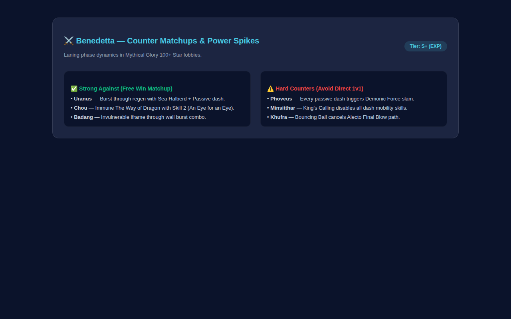

# ⚔️ MLBB Pro Strategy & Hero Matchup Hub

> **Competitive Mobile Legends guide focusing on high-tier Mythical Glory EXP lane burst combos, situational item builds, and counter matchup dynamics.**

---

## 📸 Visual Showcase & Matchup Radar

  

<em>Figure 1: EXP Lane meta fighter tier list with win rates, spell vamp setups, and recommended item paths.</em>

 

  <table width="100%">
    <tr>
      <td width="100%" align="center">
        
         <strong>Figure 2: Counter Matchup Matrix & Power Spikes</strong> 
        <em>Detailed laning phase matchups analyzing advantage trades, hard counters, and situational defense counter items.</em>
      </td>
    </tr>
  </table>

