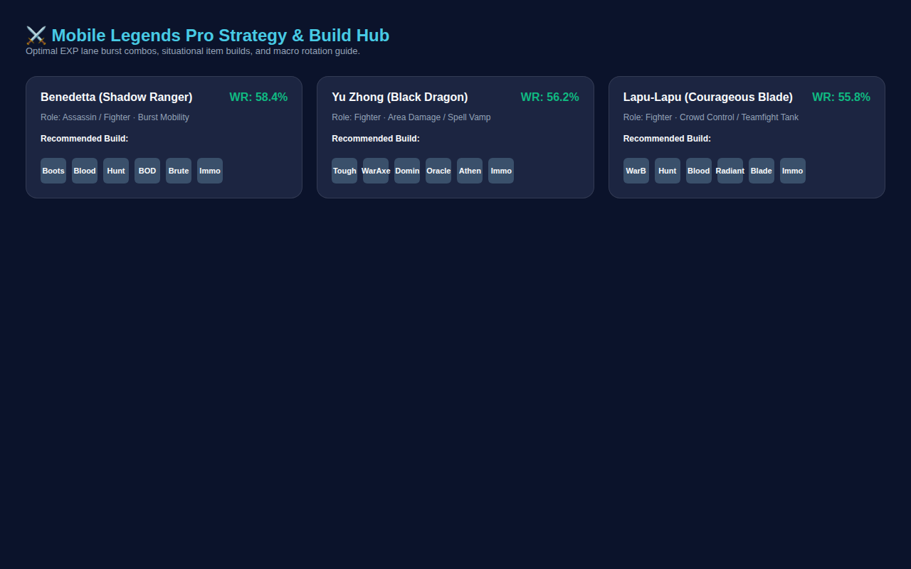

  

  # Static Website for Hero Info

  This is a code bundle for Static Website for Hero Info. The original project is available at https://www.figma.com/design/pUzAV7CH7jkLXeBKd9qdDH/Static-Website-for-Hero-Info.

  ## Running the code

  Run `npm i` to install the dependencies.

  Run `npm run dev` to start the development server.
  